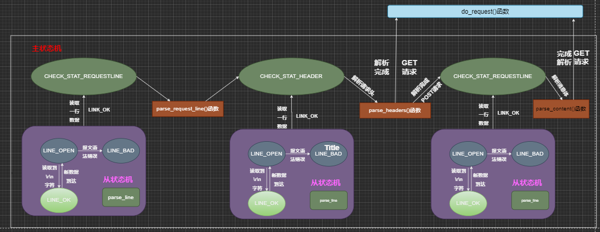
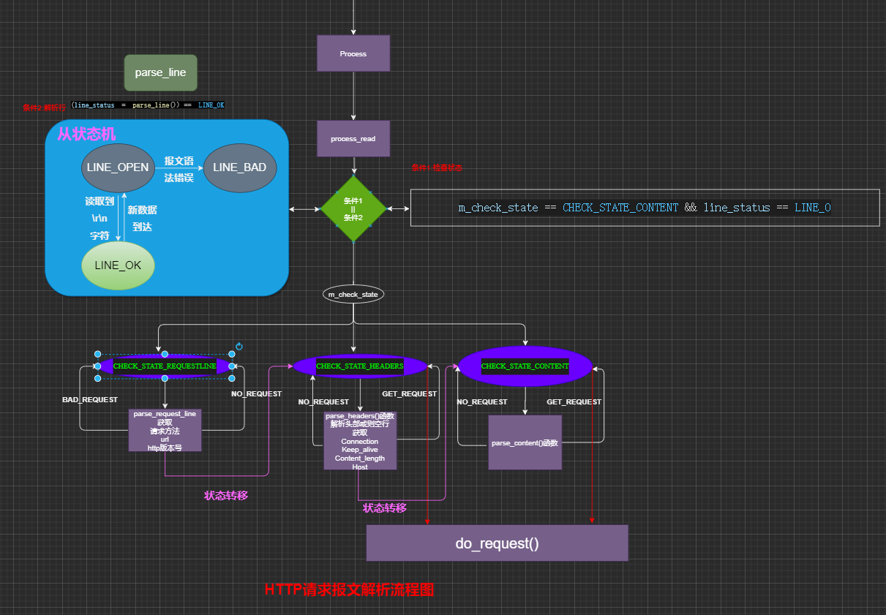
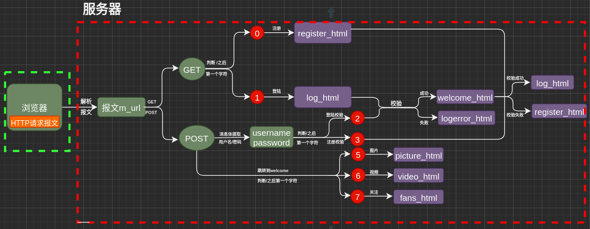
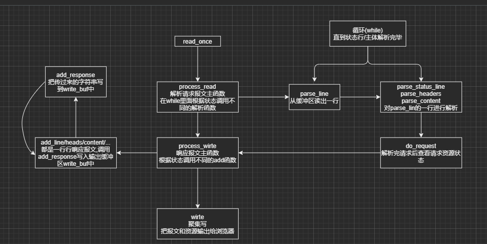

HTTP模块连接处理类:
=======================
根据状态转移 通过主从状态机封装了http连接类
主状态机在内部调用从状态机, 从状态机处理状态和将数据传给主状态机

- 客户端发出http请求
- 从状态机读取数据, 更新自身状态和接收数据, 传给主状态机
- 主状态机根据状态机状态,更新自身状态,决定响应请求或继续读取



Other
===========================
+ 提取用户名和密码
    - 服务器端解析浏览器的请求报文，当解析为POST请求时，cgi标志位设置为1，并将请求报文的消息体赋值给m_string，进而提取出用户名和密码
    
+ 同步线程登陆注册
    
    + 通过 m_url 定位 / 所在位置, 根据 / 后的第一个字符判断是登陆还是注册校验
        - 0 跳转到注册页面 GET
        - 1 跳转到登录页面 GET
        - 2 登陆校验
        - 3 注册校验
        - 5 显示图片页面 POST
        - 6 显示视频页面 POST
        - 7 显示关注界面 POST   
    - 根据校验结果,跳转到对于的页面
    - 对数据库的操作也需要通过锁来同步


HTTP模块
==================================
+ **在HTTP报文中，每一行的数据由\r\n作为结束字符，空行则是仅仅是字符\r\n,因此可以通过查看\r\n将报文头拆解为单独的行进行行解析**
+ **在HTTP报文中，请求行用来说明请求类型,要访问的资源以及所使用的HTTP版本，其中各个部分之间通过\t或空格分隔**
+ **GET和POST请求报文的区别之一是有无消息体部分，GET请求没有消息体，当解析完空行之后，便完成了报文的解析。**
    
+ 知识点: 
    + **I/O复用**: Linux下I/O复用系统调用主要有select,poll和epoll 我们这里只用到了epoll
        + select
        
        + poll
        
        + epoll
            + epoll 与select/poll有很大的差异
                - 1.epoll使用一组函数完成任务,而非单个函数
                - 2.epoll将用户关心的文件描述符上点事件放入内核事件表中,从而无须像select/poll那样每次调用都要重复传入文件描述符集或事件集
                - 3.epoll自身需要一个额外的文件描述符来唯一标识内核中这个时间表

            + epoll系列函数:
                + 1. **int epoll_create(int size)**
                    - 创建一个指示epoll内核事件的文件描述符, 该描述符将用作其他所有epoll系统调用第一个参数
                    - size参数并不其作用, 只是给内核一个提示,告诉它时间表需要多大

                + 2. **int epoll_ctl(int epollfd, int op, int fd, struct epoll_event* event)**
                    - 该函数用于操作epoll的内核事件表,可选操作: 注册, 修改, 删除
                    - epollfd为epoll_create的句柄,
                    + op: 操作
                        - EPOLL_CTL_ADD 注册fd到epollfd的内核事件表
                        - EPOLL_CTL_MOD 修改epollfd内核事件表中的fd
                        - EPOLL_CTL_DEL 删除epollfd内核事件表中
                    + event :告诉内核需要监听的事件
                        - 上述event是epoll_event结构体指针类型, 表示内核所监听点事件:
                            - epoll_event结构体
                                ```
                                struc epoll_event
                                {
                                __uint32_t events; //epoll事件
                                epoll_data_t data; //用户数据
                                };
                                ```
                            + epoll事件类型:
                                - EPOLLIN       对应的文件描述符fd可读
                                - EPOLLOUT      对应的文件描述符fd可写
                                - EPOLLPRI      对应的文件描述符fd有紧急点数据可读(带外数据到来)
                                - EPOLLERR      对应的文件描述符fd发生错误
                                - EPOLLHUP      对应的文件描述符fd被挂断
                                - [以上5种事件和poll对应的宏相同,只是在前面加了"E"]
                                - **以下两个是epoll的额外事件类型**
                                - **EPOLLET**       将epoll设为**边缘触发**(Edge Triggered)模式,相对水平触发(level Triggered)
                                - **EPOLLONESHOT 只监听一次事件**, 当监听完这次事件之后,如果还需要继续监听这个是个socket,则需要再次把这个socket加入epoll队列

              + 3. **int epoll_wait(int epollfd, struct epoll_event** * **events, int maxevents, int timout)**
                    - 在一段超时时间内等待一组文件描述符上的事件,成功返回就绪的文件描述符个数
                    + timeout 指定的超时时间 : 
                        - -1:阻塞(一直等待) 
                        - 0 :立即返回(非阻塞) 
                        - n: 指定时间(毫秒)(n>0)
                    - maxevents 最多可以监听多少个事件
                    - events, 如果检测就绪事件,就将就绪是将从内核事件表中复制到点events数组中
                     (**这个数组只用有输出epoll_wait检测到的就绪事件**),不像select和poll数组既用于传入用户注册事件,
                    又用于输出内核检测的就绪事件, 这种方法极大提高了应用程序索引就绪文件描述符点效率.           


        


            + **ET(边缘触发) |LT(水平触发)|EPOLLONESHOT**
        
        + select | poll | epoll比较
 
    + HTTP格式
        + HTTP请求报文: 浏览器发给服务器的请求
        + HTTP请求报文由**请求行（request line）、请求头部（header）、空行和请求数据**四个部分组成
            + 我们的Tinywebserver支持GET和POST方法:
                - 示例:
                    - GET
                    ```
                    1    GET /562f25980001b1b106000338.jpg HTTP/1.1
                    2    Host:img.mukewang.com
                    3    User-Agent:Mozilla/5.0 (Windows NT 10.0; WOW64)
                    4    AppleWebKit/537.36 (KHTML, like Gecko) Chrome/51.0.2704.106Safari/537.36
                    5    Accept:image/webp,image/*,*/*;q=0.8
                    6    Referer:http://www.imooc.com/
                    7    Accept-Encoding:gzip, deflate, sdch
                    8    Accept-Language:zh-CN,zh;q=0.8
                    9    空行
                    10    请求数据为空
                    ```
                    - POST
                    ```
                    1    POST / HTTP1.1
                    2    Host:www.wrox.com
                    3    User-Agent:Mozilla/4.0 (compatible; MSIE 6.0; Windows NT 5.1; SV1; .NET CLR 2.0.50727; .NET CLR 3.0.04506.648; .NET CLR 3.5.21022)
                    4    Content-Type:application/x-www-form-urlencoded
                    5    Content-Length:40
                    6    Connection: Keep-Alive
                    7    空行
                    8    name=Professional%20Ajax&publisher=Wiley
                    ```
                + 说明
                + 请求报文构成: **请求行 + 头部 + 空行 + 请求数据(主体)**
                    + 请求行，用来说明请求类型,要访问的资源以及所使用的HTTP版本。GET说明请求 类型为GET，/562f25980001b1b106000338.jpg(URL)为要访问的资源，该行的最后一部分说明使用的是HTTP1.1版本。

                    + 头部，紧接着请求行（即第一行）之后的部分，用来说明服务器要使用的附加信息。
                        - HOST，给出请求资源所在服务器的域名。
                        - User-Agent，HTTP客户端程序的信息，该信息由你发出请求使用的浏览器来定义,并且在每个请求中自动发送等。
                        - Accept，说明用户代理可处理的媒体类型。
                        - Accept-Encoding，说明用户代理支持的内容编码。
                        - Accept-Language，说明用户代理能够处理的自然语言集。
                        - Content-Type，说明实现主体的媒体类型。
                        - Content-Length，说明实现主体的大小。
                        - Connection，连接管理，可以是Keep-Alive或close。

                    + 空行 :请求头部后面的空行是必须的即使第四部分的请求数据为空，也必须有空行。

                    + 请求数据(主体):可以添加任意的其他数据。
        
        + HTTP响应报文: 服务器返回给浏览器的请求
        + HTTP响应也由四个部分组成，分别是：**状态行、消息报头、空行和响应正文**
            + 示例:
                ```
                1   HTTP/1.1 200 OK
                2   Date: Fri, 22 May 2009 06:07:21 GMT
                3   Content-Type: text/html; charset=UTF-8
                4   空行
                5   <html>
                6      <head></head>
                7      <body>
                8            <!--body goes here-->
                9      </body>
                10  </html>
                ```
            + 说明:
                - 状态行，由HTTP协议版本号， 状态码， 状态消息 三部分组成。
                 第一行为状态行，（HTTP/1.1）表明HTTP版本为1.1版本，状态码为200，状态消息为OK。

                - 消息报头，用来说明客户端要使用的一些附加信息。
                  第二行和第三行为消息报头，Date:生成响应的日期和时间；Content-Type:指定了MIME类型的HTML(text/html),编码类型是UTF-8。

                - 空行，消息报头后面的空行是必须的。**空行仅包含一对回车换行符<CR><LF>(\r\n)**

                - 响应正文，服务器返回给客户端的文本信息。空行后面的html部分为响应正文。

    + **HTTP 状态码**
        + HTPP共有5种状态码,具体如下:
            + 1xx :指示信息 --> 表示信息已经接收,继续处理
            + 2xx :成功 --> 表示请求正常处理完毕
                - 200 OK:客户端请求被正常处理
                - 206 Partial Content:客户端进行了范围请求
            + 3xx :重定向 --> 要完成请求必须进行进一步操作
                - 301 Moved Permanently: 永久重定向 该资源已被永久移动到新位置,将来任何对该资源的请求访问都要使用本响应返回点若干个URL之一.
                - 302 Found : 临时重定向, 请求点资源现在临时从不同点URL中获取
            + 4xx : 客户端错误 --> 请求有语法错误,服务器无法处理请求
                - 400 Bad Request :请求报文存在语法错误
                - 403 Forbidden : 请求被服务器拒绝
                - 404 Not Found : 请求不存在慢服务器上找不到这个请求点资源
            + 5xx : 服务器端错误 --> 服务器处理请求出错
                - 500 Inernal Server Error : 服务器在执行请求时出现错误

    + **有限状态机[finite-state-machine]**
        + 有限状态机是一种高效的编程方法,在服务器编程中,服务器可以根据不同状态或队列消息类型进行相应的逻辑处理, 使得程序逻辑清晰易懂
        + 宏观角度看 主状态机 与 从状态机:
            + 主状态机更为宏观一些, 关注的是当前解析的是请求报文中的那一部分(请求行?请求头部信息? 空行? 请求主体?),根据主状态机的状态判断当前的解析进度从而判断下一动作.
            + 从状态机更聚焦于一行行内容的细节:
                - 当前字符是什么?当前行是否完整,格式是否有误,是否已读完?
                - 更加关注解析状态
                - 若是完整的一行,需要将行尾的\r\n替换为\0\0
            + 关系  :
                - 一个主状态机可能对应多轮从状态改变
                - 两者类似与包含关系
        + 主状态机
        + 从状态机
            + 从状态机从m_read_buffer读取数据,**将\r\n(http请求报文一行结束的标识)替换为\0\0** ,同时更新从状态机在m_read_buffer中读取位置(m_check_idx),以此不断驱动主状态机进行解析
                + 从状态机从m_read_buffer中逐字节读取,判断当前字节是否是 \r 或 \n(见书143)
                    - 若是\r,判断接下来的字符
                        - 是\n,则读取了完整的一行,将\r\n替换为\0\0,返回LINE_OK
                        - 是m_read_buffer末尾,表示还需要接受,进一步分析,返回LINE_OPEN
                        - 否则, 表示语法错误, 返回LINE_BAD
                    - 若是\n, 判断前一个字符
                        - 若是\r,则读取了完整的一行,将\r\n替换为\0\0,返回LINE_OK
                        - 否则, 表示语法错误, 返回LINE_BAD
                    - 否则,表示接受不完整,需要继续接受,返回LIN_OPEN

    + 基础API
        + stat: 文件相关函数
            - 原型:int stat(const char* pathname, strcut stat* statbuf)
            - 作用 : 通过文件名filename获取文件信息，并保存在buf所指的结构体stat中,成功则返回0，失败返回-1
            + struct stat是一个结构,具体可查阅,本项目用到的成员如下: 
                - st_mode 文件类型和存取权限
                - st_size 文件字节数(文件大小)
            + 通过 **S_ISDIR(m_file_stat.st_mode)**来判断是否是一个目录

        + mmap: 内存映射函数
            - 原型: void* mmap(void* start,size_t length, int prot, int flags, int fd, off_t offset) 
            - 原型 : int munmap(void* start, size_t length);
            - 作用: 将一个文件或其他对象映射到内存,提高文件的访问速度
            + 参数: 
                - start 映射区的开始地址, 设置为NULL表示系统自动分配地址
                - length 映射区长度
                + prot 设置内存段访问权限
                    - PROT_READ  内存段可读
                    - PROT_WRITE 内存段可写
                    - PROT_EXEC  内存段可执行
                    - PROT_NONE  内存段不能被访问
                - flag指定映射对象的类型, 映射选项和映射页是否可以共享
                    -  MAP_PRIVATE建立一个写入时拷贝的似有映射,内存区域的写入不会影响原文件
                - fd 文件描述符,一般通过open()获取
                - offset被映射对象内容的起点

        + iovec: 定义了一个向量元素, 这个结构用作一个多元素的数组
            ```
                struct iovec
                {
                    void *iov_base; //内存起始地址
                    size_t ivo_len; //内存块长度
                }
            ```
        + writev: 集中写
            - 原型: ssize_t writev(int fd, const strcut iovec* vector, int count);
            - 作用: 在一次调用中,写入多个非连续的缓冲区(聚集写)
            + 参数:
                - fd 文件描述符
                - vector iovec类型数组
                - count vector数组长度


信号量
==================================
信号相关
>* SIG_IGN ：忽略的处理方式，这个方式和默认的忽略是不一样的语意，暂且我们把忽略定义为SIG_IGN，
在这种方式下，子进程状态信息会被丢弃，也就是自动回收了，所以不会产生僵尸进程，但是问题也就来了，
wait，waitpid却无法捕捉到子进程状态信息了，如果你随后调用了wait，那么会阻塞到所有的子进程结束，并返
回错误ECHILD，也就是没有子进程等待

+ C++线程安全的单例模式总结:
    + 线程安全: 
    + 单例模式: 在整个系统生命周期中,保证一个类只能产生一个实例, 确保该类的唯一性
        + 单例类特点:
            - 构造函数和析构函数为private 目的禁止外部构造和析构
            - 拷贝构造和赋值构造函数为private, 目的禁止外部拷贝和赋值,确保实例的唯一性
            - 类里面有个获取实例的静态函数,可以全局访问

        + 懒汉模式: 系统运行时,类的实例并不存在,只有但需要该实例时才会去创建并使用该实例.**需要考虑线程安全问题**
            - 时间换空间, 适用访问量小的
            - 因为可能存在创建多个实例因此存在线程安全问题
                + 解决方法:
                    - 加锁[线程安全]
                    - 使用内部静态变量的懒汉模式[线程安全]
                    
        + 饿汉模式: 系统一运行,就初始化创建实例,需要时直接调用即可.**线程本身安全,因为没有多线程问题**

        + 区别: 创建实例的时间不同,懒汉模式在需要时才创建,而饿汉模式在一开就创建,需要时只是使用即可.
        
统一事件源
==================================
>>* 信号是一种异步事件:信号处理函数和程序的主循环是两条不同的执行路线因此,信号处理函数需要尽可能地快执行完毕,以确保该信号不会被屏蔽(为避免一些竞态, 信号处理期间,系统不会再次触发它)太久.典型的解决方案: 把信号的主要处理逻辑放在程序的主循环中,当信号值传递给主循环时,主循环在根据收到的信号值去执行目标信号对应的逻辑代码.
>>* 信号处理函数通常使用管道将信号"传递"给主循环:信号处理函数往管道写入信号值,主循环从管道的读端读出该信号值
    >>>* 主循环如何知道管道上何时有数据可读?? -> 使用I/O复用系统调用来监听管道上的读端文件描述符上的读事件**如此一来,信号事件和其他I/O事件一样被处理,即为统一事件源**

ET与LT
==================================
