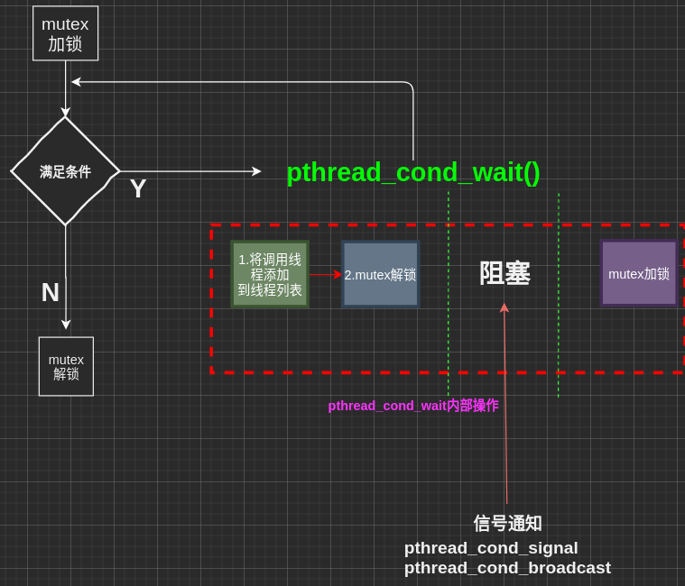

线程同步机制包装类
=====================================
+ 一 . 将线程同步方式封装成类[**实现多线程同步, 通过锁机制,确保任何时刻只有一线程能进入临界区**[见书14章-多线程编程]]:
    + 作用: 将mutex,cond,sem分别封装为3个类,线程同步机制封装类, 提供线程同步工具
    + 利用RAII的思想,在lock模块中,使用类来管理成员,将资源和对象的生命周期绑定   
    + 构成:
        - 信号量[sem]
        - 互斥锁[mutex]
        - 条件变量[cond]


+ 二. 线程同步方式:
   + 1. 信号量[sem]:信号量是一种特殊的变量,它只能取自然数且只支持两种操作:等待(P)和信号(V)
        + 对一组信号量SV:
           - P 如果SV的值大于0,则SV的值-1,若SV=0,则需要该信号量的线程被挂起 
           - V 如果有等待信号而被挂起的线程,则被唤醒, 若没有,则SV+=1
        + **信号量可以取任何数,最常用的还是二进制信号量,只有0和1两个值**
        + POSIX信号量sem: 以下函数成功返回0,失败返回错误码errno
            ```C++
            sem_int()      //初始化一个未命名的信号量]        
            sem_destory()  //销毁信号量
            sem_wait()     //以原子操作方式将信号量-1,若信号量值为0,则阻塞等待直到信号量有非零值,前面的P操作
            sem_trywait()  //与前一个类似,但不论成功与否就立即返回,非阻塞
            sem_post()     //以原子操作方式将信号量的值+1,前面的V操作
            ```

    + 2.互斥锁[mutux]:保护关键代码段,确保其被独占式的访问:**获取互斥锁->互斥锁加锁 ->进入临界区->operator ->离开临界区 -> 解锁**
        + 以下函数成功返回0,失败返回错误码errno
            ```C++
            pthread_mutex_init()    //初始化互斥锁
            pthread_mutex_destory() //销毁互斥锁]
            pthread_mutex_lock()    //以原子操作给一个互斥锁加锁,若已被加锁,则阻塞等待.
            pthread_mutex_trylock() //与前面类似,但是立即返回,非阻塞版
            pthread_mutex_unlock()  //以原子操作给一个互斥锁解锁
            ```       
            + 在使用互斥锁必须注意避免死锁

    + 3.条件变量[cond]:**提供一种线程间通知机制,当某个共享数据到达某个值,唤醒等待该数据的线程**
        + 条件变量是利用线程间共享变量进行同步的一种机制:两个动作
            - 1. 线程因等待条件变量成立而而被挂起
            - 2. 条件变量成立(给出成立信号)唤醒等待的线程
        + 为了防止竞争,条件变量总是和一个互斥锁结合使用[*条件变量与互斥锁一起使用`，使得线程以无竞争点方式等待条件变量的发生*]
        + 条件变量改变过程如下[**条件变量本身是由互斥锁保护的**]：
            - 获取互斥锁(加速)
            - 计算条件变量
            - 释放锁(解锁)
            - 线程在改变条件前必须先锁住互斥锁，其他线程在获取互斥锁之前是不会察觉这种改变，因为必须锁定互斥锁以后才能计算互斥锁[APU-P309]

        + 以下函数成功返回0,失败返回错误码errno
            ```C++
            pthread_cond_init()      //初始化某个条件变量
            pthread_cond_destory()   //销毁条件变量
            pthread_cond_broadcast() //广播唤醒所有等待目标条件变量的线程
            ptrhead_cond_signal()    //按某种方式只唤醒某一个等待目标条件变量的线程(**取决于优先级和调度策略**)] ?????
            pthread_cond_wait()      //阻塞式等待，直到条件满足或出错
            pthread_cond_timewait()  //指定时间等待，直到条件满足或超时或出错
            ```
            + **pthread_cond_wait()过程**：
                - 获取互斥锁(加锁)
                +  **pthread_cond_wait()内部过程**：
                    - *将调用线程放入等待条件变量点线程队列*[原子操作]
                    - *释放锁(解锁)*[原子操作]
                    - *阻塞直到获取条件变量*
                    - *获取互斥锁(加锁)*
                - 释放锁(解锁)
                

            + **条件变量API 与陷阱** :
                - pthread_cond_wait() 用于等待目标条件变量.
                + 传递给 pthread_cond_wait()的互斥锁对条件进行保护, *调用者把锁住的互斥锁传递给该函数,该函数把线程放到等待的条件的线程列表上,然后***对互斥锁解锁**[这两个操作是原子操作](1.将线程放到列表,2.对互斥锁解锁),当函数成功返回0时,表示重新抢到互斥锁,互斥锁再次被加锁
                    - 函数调用传入mutex参数[互斥锁加锁]
                    + pthread_cond_wait()执行后内部操作:
                        - **1.将调用线程放入条件变量的请求队列 2.互斥锁mutex解锁**
                        - *线程等待被唤醒*[pthread_cond_broadcast|pthread_cond_signal]
                        - **竞争资源[互斥锁], 若成功返回(0),互斥锁再次被加锁**
                    - *也即是所pthread_cond_wait()函数内部会有一次加解锁的操作*

                    

             + 条件变量的产原因:
                - 若没有条件变量,则先加锁,进入临界区查看是否满足条件,不满足,解锁离开临界区,过一断时间重复此操作.这样不断加解锁,开销大且费时.
                - 引入条件变量后,加锁,判断是否满足,如不满足,调用 pthread_cond_wait, 它会在满足条件时发出通知,这样就避免了循环加解锁
                + 1. *传入前[调用pthread_cond_mutex前]加锁* **是为了保证从条件判断到进入pthread_cond_wait前,条件不被改变[避免竞争,使得每个线程互斥访问共享资源]**
                + 2. *传入后解锁* **如果条件满足,会调用pthread_cond_wait()阻塞自己,此时若继续持有锁,则其他锁将无法访问该资源[比如phread_cond_signal需要先加锁(申请到资源)然后才能被调用发出通知]**,若不解锁,等待的条件就一直不会满足.
                + 3. *返回前再次被加锁* **为了保证从pthread_cond_wait返回到再次条件判断前不被改变,保证在pthread_cond_signal之后和解锁mutex之间可能需要的其他语句能够执行**

         + 4. pthread_join(thread_id)[一种简单的同步方式]: 调用者阻塞自己,直到调用线程返回,这种方式无法实现复杂的同步需求(比如临界资源的独占式访问)


other知识点
=====================================
+ Linux下某一个操作被打断的原因:
   - 中断
   - CPU被抢占
+ **原子操作**: *在执行某一个操作时不被打断*
+ 原子操作两大类:
    - 加锁
    - 原子操作函数, 比如这里的sem_wait()就是一个原子操作函数

+ RAII(Resouce Acquistion initialization)[资源获取即初始化]
        - 在构造函数中申请资源并初始化,析构函数中释放资源
        - **RAII核心思想**: 将资源或状态与对象的生命周期绑定,通过C++语言机制,实现资源或状态的安全管理
        - C++中智能指针就是RAII最好的例子

线程相关点
=====================================
- 进程与线程：
    - 类似“进程是资源分配的最小单位，线程是CPU调度的最小单位”这样的回答感觉太抽象，都不太容易让人理解。
    + 做个简单的比喻：进程=火车，线程=车厢
        - 线程在进程下进行（单纯的车厢无法运行）
        - 一个进程可以包含多个线程（一辆火车可以有多个车厢）
        - 不同进程间数据很难共享（一辆火车上的乘客很难换到另外一辆火车，比如站点换乘）
        - 同一进程下不同线程间数据很易共享（A车厢换到B车厢很容易）
        - 进程要比线程消耗更多的计算机资源（采用多列火车相比多个车厢更耗资源）
        - 进程间不会相互影响，一个线程挂掉将导致整个进程挂掉（一列火车不会影响到另外一列火车，但是如果一列火车上中间的一节车厢与前一节产生断裂，将影响后面的所有车厢）
        - 进程可以拓展到多机，进程最适合多核（不同火车可以开在多个轨道上，同一火车的车厢不能在行进的不同的轨道上）
        - 进程使用的内存地址[资源]可以上锁，即一个线程使用某些共享内存时，其他线程必须等它结束，才能使用这一块内存。（比如火车上的洗手间 -- **"互斥锁"**
        - 进程使用的内存地址[资源]可以限定使用量（比如火车上的餐厅，最多只允许多少人进入，如果满了需要在门口等，等有人出来了才能进去--**“信号量”**

+ 线程: 
    - 线程是进程的一个实体，是CPU调度的最小单位
    - 线程基本不拥有系统资源，**只有一些必不可少的资源**：
        - *一组寄存器*
        - *程序计算器*
        - *栈*
    - 可与同属一个进程的线程共享进程的资源
+ 线程实现的模式：
    - 完全在用户空间
    - 完全由内核调度
    - 双层调度

