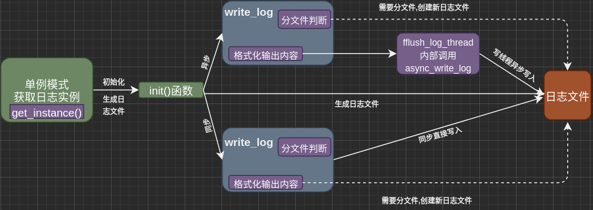

同步/异步日志系统：
=======================
> * 同步/异步日志系统涉及到两个模块：
    > * 日志模块
    > * 阻塞队列模块[解决异步写入日志做准备]

> * 自定义阻塞队列
> * 单例模式创建日志
> * 同步日志
> * 异步日志
> * 实现按天|超行分类


日志系统
====================================
> * 采用的是单例模式，支持自动按天分文件，按日志行数自动分文件，是多线程安全的单例模式。在日志安全级别高的情况，不能丢失日志的情况，可以使用同步模式， 在要求应用程序性能高对日志安全级别不高的情况可以使用异步模式，异步模式就是在程序异常奔溃或者是重启服务的情况可能有日志丢失。

>* 单例模式
    >>* 使用的单例模式中的懒汉模式:懒汉模式存在线程安全问题,解决办法如下:
        >>>*  在类内部使用局部静态变量: C++11后此方式线程安全,且避免了加锁
        >>>*  使用锁
        
>* 分类
    >>>* 按天分类
    >>>* 超行分类

>* 记录日志方式
    >>* 同步日志
    >>* 异步日志
        >>>* 自定义阻塞独列

> *  示意图:
    


知识点
====================================
+ 日志: 由服务器自动创建, 并记录运行状态,错误信息, 访问数据等信息

    + 同步日志: 日志写入函数和工作线程串行工作[二者串行,同步模式]
        - 日志写入函数,将产生的信息写入文件,设计到I/O操作,当单条日志比较大是,**这种方式会阻塞整个处理流程[工作线程被阻塞]**,使得服务器所能处理的并发能力下降,尤其是在峰值时,写日志可能是成为系统的瓶颈,
        - 同步的好处是保证产生一条日志记录就立即写入,从而可以保证日志信息不会丢失

    + 异步日志: 将日志内容封装起来,放入某种容器,单独创建一个线程从容器中取数据写入文件,也即是**写日志线程和工作线程是并行[二者并行,异步模式]**[我们这里用的是阻塞队列,将工作将日志记录插入队列,日志线程从队列中取然后写入文本](*类似生产者与消费者模式*)
        - 异步的好处是不会阻塞工作线程,但是由于日志记录是间接写入,可能会丢失

    + **生产者与消费者模型**[并发编程的经典模型]:

    + *阻塞队列* : 这里用阻塞队列来存储日志记录, 将生产者-消费者模型进行封装, 使用循环实现队列,作为生产者-消费者的缓冲区

    + **单例模式**:  保证一个类只能创建一个实例,同时提供全局访问的方法[**单例模式是面试高频问题**]
        - 将 它 的构造含糊私有化,防止外部创建单例对象.
        - 使用类的私有静态指针变量指向类的唯一实例
        - 用一个公有的静态方法获取该实例

        - 比如 window的任务管理器
            - 微信为什么只能登陆一个??

        + 懒汉模式 : 在运行时才初始化[使用时才去初始化] **存在线程安全问题**
        + 饿汉模式 : 程序开始时就初始化[一开始就初始化] **不存在线程安全问题** 
            - 程序一开始时就已经初始化,任何线程调用getinstance()时,都只是返回一个对象的指针而已

            + **存在潜在问题**: *在于非静态对象在不同编译单元中的初始化顺序是未定义的,若在single初始化完成之前调用getinstance()方法,返回的是一个未定义的实例*


+ C++线程安全的单例模式总结:
    + 线程安全: 
    + 单例模式: 在整个系统生命周期中,保证一个类只能产生一个实例, 确保该类的唯一性
        + 单例类特点:
            - 构造函数和析构函数为private 目的禁止外部构造和析构
            - 拷贝构造和赋值构造函数为private, 目的禁止外部拷贝和赋值,确保实例的唯一性
            - 类里面有个获取实例的静态函数,可以全局访问

        + 懒汉模式: 系统运行时,类的实例并不存在,只有但需要该实例时才会去创建并使用该实例.**需要考虑线程安全问题**
            - 时间换空间, 适用访问量小的
            - 因为可能存在创建多个实例因此存在线程安全问题
                + 解决方法:
                    - 加锁[线程安全]
                    - 使用内部静态变量的懒汉模式[线程安全]
                    
        + 饿汉模式: 系统一运行,就初始化创建实例,需要时直接调用即可.**线程本身安全,因为没有多线程问题**

        + 区别: 创建实例的时间不同,懒汉模式在需要时才创建,而饿汉模式在一开就创建,需要时只是使用即可.
        


>* :
    >>* strrchr(const char* str, int ch) 在str查找 ch 最后出现的位置
    >>* sprintf(char *stri,char *format,arg_list) 发送格式化输出到 str 所指向的字符串,可能导致缓冲区溢出
    >>* snprintf(char *str, size_t size, const char *format, ...) 和 sprintf()作用相同,提供缓冲区的可用大小传入参数来保证缓冲区的不溢出，如果超出缓冲区大小则进行截断


日志系统
====================================
+ 两大部分:
    - 单例模式 + 阻塞队列
    - 日志类的定义与使用

+ 基础API
    + fputs()
        ```C++
         int fputs(const char* str, FILE* stream)
        ```
         - str 待输出字符串的首地址
         - stream 指向FILE对象的指针,该FILE对象标识了要被写入的字符串流
         - *fputs()可以想任何流输出,系统不会添加换行符, puts只能向标准输出流输出,且系统会自动在其后面添加换行符*

    + 可变参数宏 __VA_ARGS__ : 是一个可变参数宏
        -  定义时宏定义汇总参数列表的最后一个参数为省略号,在实际使用时会发现有时会家 ##,有时又不加
        ```C++
        #define my_print1(...) printf(__VA_ARGS__)

        #define my_print2(format, ...) printf(format, __VA_ARGS__)
        #define my_print3(format, ...) printf(format, ##__VA_ARGS__)
        ```
        - *__VA_ARGS__宏前面加入 ## 的作用在于,当可变参数个数为0时,这里的printf()参数列表会将 ## 前面多余的 "," 去掉,否则编译会出错[建议使用第三种形式,增强程序鲁棒性]*
    
    + fflush(): 强制将缓冲区的数据写入参数 stream 指向的文件中
        ```C++
         int fflush(FILE* stream);
        ```
        - 若 stream 为NULL, fflush()会将所有打开的文件数据更新[写入所有打开的文件??]

    - 在使用多个输出函数连续进行多次输出到控制台时,有可能下一个数据在上一个数据还没有完全输出完毕时,就把数据输入到缓冲区,导致原来的数据输出错误, **在prinf()后面加上fflush(stdout),强制马上输出到控制台,从而避免出现这种错误**
+ 流程图与日志类的定义:
    - 局部变量的懒汉模式获取实例
    + 生成日志文件, 根据queue_size判断是哪种写入方式
        - queue_size = 0 同步写入
            - 判断是否分文件
            - 直接格式化输出内容,将信息写入日志文件

        - queue_size > 0 异步写入
            - 判断是否分文件
            - 格式化输出内容,将内容写入阻塞队列
            - 创建一个写线程,从阻塞队列中取下内容写入日志文件
        
        - 日志流程
                


+ 功能实现
