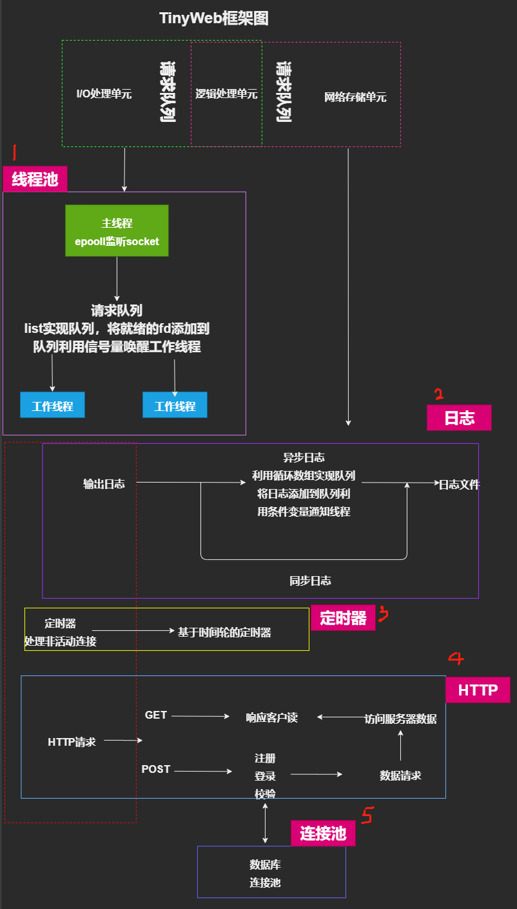
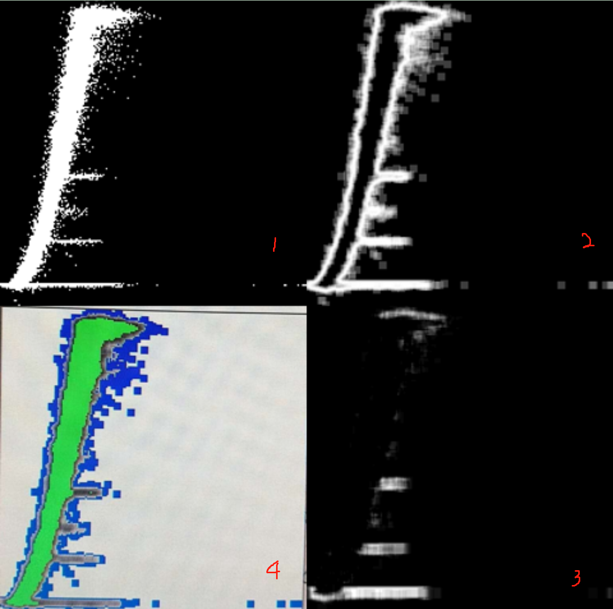
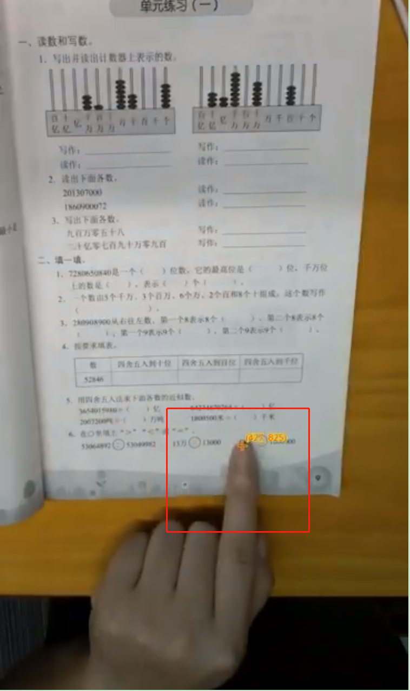
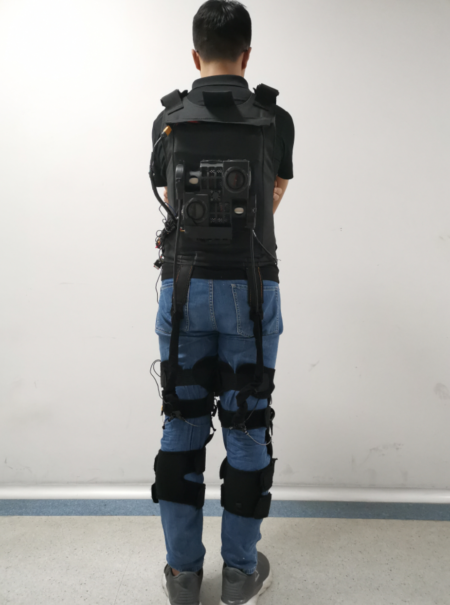

参考社长的项目和游双老师的<<Linux高性能服务器编程>>实现的轻量级服务器 TingyWeb 项目

TinyWeb :一个Linux下C++轻量级Web服务器
===========================================================
+ Linux下C++用来学习的Web服务器，结合之前的学习，搭建轻量级服务器。
	* 基于BS模型，，采用epoll边沿触发模式(ET)来实现IO复用，使用同步IO模拟Proactor事件处理模式的并发模型
	* 使用状态机解析http报文：主状态机内部调用从状态机，从状态机驱动主状态机
	* 采用基于时间轮的定时器定期处理**非活跃连接**
	* 支持用户**注册，登录**功能，支持post和get方法
	* 实现**日志系统**[同步/异步]记录服务器运行状态
	* 经Webbench压力测试可以实现**上万的并发连接**数据交换
	
+ 组成:分为8个模块
    + lock(线程同步)模块[见lock文件夹]
    + 数据库模块：
        - mysql连接池模块[见CGImysql文件夹]
    + 定时器[见timer文件夹]
        - 基于时间轮的定时器
    + pthreadpool(线程池)模块[见threadpool文件夹]
    + http(http解析和响应)模块[见http文件夹]
        + http解析类：使用有限状态机的设计思想，封装了http连接处理类，以实现解析报文请求和发送。[这里只有主状态机和从状态机]
    + 日志系统[见log文件夹]
        + 同步日志
        + 异步日志
    + 测压模块[test_presure]
        - 这是一个第三方测试工具 
    + root模块[将root文件夹]
        + 文件
        + 页面(html)
    + main模块[将main文件夹]

TinyWeb框架图
======================
 


TinWeb环境
------------
* 服务器环境
	* Ubuntu版本16.04
	* MySQL 8.0.21 版
* 浏览器环境[Linux/Window下均可]
	* Chrome
	* FireFox
* 采用数据库保存用户和密码，因此需要提前安装mysql[本项目中使用的Mysql 8.0.21 ]

* util 中的 create 指定数据库名和表名即可【可以指定也可以使用默认的方式】

* 修改main.c中的数据库初始化信息
    ```C++
    connPool->init("localhost", "root", "root", "yourdb", 3306, 8); // root root修改为服务器数据库的登录名和密码
    ```
* 修改http_conn.cpp中的root路径
    ```C++
    const char *root = "/home/ubuntu16_04/learnGit/TinWeb/root"; //root目录下存放请求的资源和html文件
    ```
    
* 生成并启动server
    ```C++
    make server
    ```
    xxx# ./server port
    示例: xxx# ./server 12345

* 浏览器端访问：
    ```
    ip:port
    ```
    示例：http://49.234.91.121:12345
    
* 使用Webbench测试结果：
```
//命令
webbench -c 500 -t 5 http://127.0.0.1:5678/6
500 clients, running 5 sec.

//结果
Speed=1134156 pages/min, 2117068 bytes/sec.
Requests: 94513 susceed, 0 failed.
```
**🔗 TinyWeb服务器地址： http://49.234.91.121:12345/  欢迎访问**

服务器下的三个页面分别是本人所作项目：
1.风力发电数据：之前做的第一个项目：通过图像的方法，对风力发电机采集的数据进行分离，并对异常数据进行分裂，图像1是原图，图像4绿色是最后提取的正常数据组成的，2，3是异常不同类型的异常数据。  
     
    
2.手指指尖位置的获取和跟踪: 在教育机器人小墨上得到实际应用，主要是获取指尖的位置并反馈给系统，作为实现指哪儿读哪儿功能的重要部分。
       
    
3.下肢柔性外骨骼系统: 作为实验室主要项目，柔性下肢外骨骼主要是为老弱病残等人群提供助力以及为特定工作者提供助力。
     

