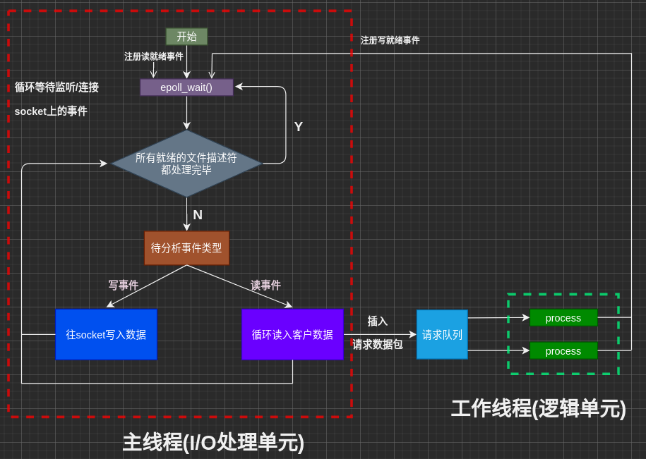
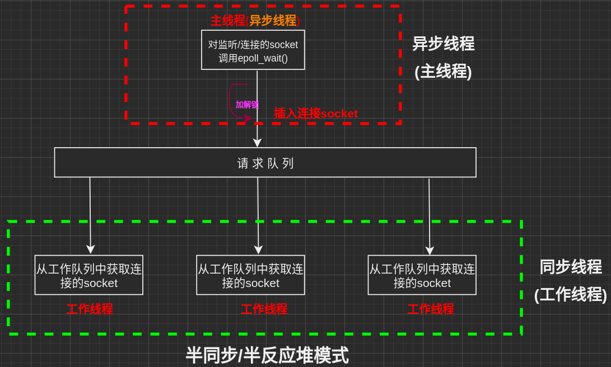
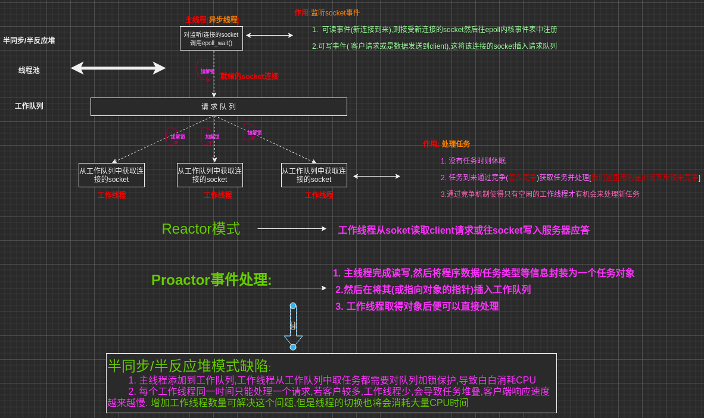

半同步/半反应堆线程池
================================
使用一个工作队列完全解除主线程与工作线程的耦合关系：
    主线程：往工作队列中插入任务
    工作线程通过 竞争 来取得任务并执行

+ 同步I/O 模拟 procator模式
+ 半同步/半反应堆
+ 线程池

+ 一. 使用同步I/O模拟 Proactor模式
    - **同步I/O模拟 Proactor 模式 原理**: *主线程[I/O逻辑单元]执行数据读写操作,读写完成之后,主线程向工作线程[逻辑处理单元]通知这一"完成事件",从工作线程角度看,它们就直接获取了读写结果, 接下只是对读写的结果(数据)进行逻辑处理*
    - 同步I/O模拟Proactor模式的工作流程图(P130.8-7):
       

+ 二. 使用半同步/半异步模式:
    - 同步线程用于处理客户逻辑[逻辑单元]
    - 异步线程用于处理I/O事件[I/O处理单元]
    - 异步线程监听到有客户请求 -> 封装为请求对象插入请求队列 -> 请求队列通知某个工作在同步模式的工作线程读取并处理请求对象

    +  半同步/半异步变体[处理模式+I/O模型组合]:
        - 半同步/半反应堆[half-sync/half-reactive]模式:
        - 
        + 以本项目的 同步I/O 模拟Proactor为例:
            - 主线程充当异步线程(负责监听sokcet事件和数据读写)[主线程接受数据封装成对象然后插入队列]
            - 工作线程通过竞争获取请求队列中任务并处理

+ 三. 线程池 设计为 半同步/半反应堆模式, 采用同步I/O模拟 Proactor模式
    + 主线程(异步线程)监听文件描述符,接受新的socket连接
        - 读事件 将任务插入请求队列
    + 工作线程(同步线程)从队列中取出任务并处理数据

工作流程
=========================

+ 函数
    + 1. pthread_create(arg1, arg2, arg3, arg4) 创建线程
        - arg3必须是一个指向静态函数的函数指针
        - arg4是arg3指向的函数的参数P304  
    + 2.  thread_detahc() 将线程状态设置为detached
        - 函数1创建的线程默认状态是joinable,如果一个线程运行结束但是没有被pthread_join[回收线程],则该线程的状态**类似进程的Zombie[僵尸]进程**(资源没有被回收),因此,一般线程会调用pthread_join()等待该线程结束,得到该线程的状态码,回收其资源[类似进程的wait和waitpid];但是pthread_join(thread_id)的调用者会被阻塞,在Web服务器中主线程为每个新来的连接创建一个子线程时,主线程并不希望被阻塞,此时便可以使用pthread_detach(thread_id)[非阻塞],将子线程状态设置为detached,**这样子线程结束后便可以自动释放所有源**.
    + 3. sem_wait(): 以原子操作将信号值-1,如果信号值为0,则阻塞知道这个信号量为非零值.
    + 4. sem_post(): 以原子操作将信号值+1,若信号值大于0且有sem_wait()等待的线程,则将以某种方式唤醒.
    + 5. pthread_mutex_lock() 加锁
    + 6.  pthread_mutex_unlock() 解锁

+ 其他
    + std::list类
    + C++异常机制
    + cat /proc/sys/kernel/threads_max 查看用户最大可创建的线程数
    + 工作线程通过竞争来获取任务,这里的资源是互斥锁?那这些线程之间怎么竞争互斥锁的呢???????

    + 线程池由一个线程安全的队列，以及多个 worker 线程组成。
    可以有多个 producer 线程，它们负责提交任务给线程池。
    接收到新任务之后，线程池会唤醒某个 worker 线程，worker 线程醒来后会取出任务并执行。

Other
================================

+ 一. 服务器基本框架[见书第8章]:
+ 二. I/O模型
+ 三. 事件处理模式

+ I/O方式： 
    + 1. 阻塞I/O: 若无法立即完成会被操作系统挂起等待,直到等待的事件发生为止(程序阻塞于读写)
        - accpet(),send(), recv(), connect()
        - select()默认是阻塞的,第二个参数可设置为**SOCK_NONBLOCK**变为非阻塞的
    
    + 2. 非阻塞I/O: 调用时不管是否发生,总是立即返回,成功返回对应的值,失败返回-1,并设在errno[事件为发生时通常设置为**EAGAIN或EWOULDBLOCK**]
        - 为提高效率,非阻塞I/O通常和I/O通知机制一起使用
    
    + 3.  常见的I/O通知机制
        + 3.1 I/O复用:(阻塞于I/O复用系统调用)
            - 过程: 应用程序通过I/O复用函数向内核注册一组事件, 内核通过I/O复用函数把已就绪的事件通知给应用程序
            - 常用I/O复用函数: *select(), poll(), epoll系列函数(epoll_wait)*
            - **I/O复用函数本身是阻塞的,它们能提高程序效率的原因在于它们具有同时监听多个I/O事件的能力**
        + 3.2 4.SIGIO信号:当事件发生时,指定的信号被触发读写就绪事件, 然后程序执行I/O操作,(程序没有阻塞阶段)

    + 4. 同步I/O: 向应用程序通知**就绪事件**,(*应用程序自己去执行I/O操作*然后才可用)
        - 阻塞I/O, 非阻塞I/O, I/O复用, 信号驱动I/O都是 **同步I/O模型**[*因为它们的读写操作都是在I/O事件发生之后*, 由**应用程序完成**,]
        - *同步I/O要求用户代码完成自行执行I/O操作[**将数据从内核缓冲区读入用户缓冲区或从用户缓冲区读入内核缓冲区**]*

    + 5.异步I/O: 向应用程序通知**完成事件**(直接可用),[*I/O就绪事件后,内核帮助完成I/O操作*],(程序没有阻塞阶段)
        - 应用程序告知内核读写缓冲区位置
        - I/O事件就绪后,内核完成I/O操作
        - 返回后,应用程序直接可用
        - **异步I/O总是立即返回**[*不管I/O方式是否是阻塞的*],**因为真正的读写操作(I/O)操作由内核完成**
        - *由内核来执行I/O操作[**数据在内核缓冲区和用户缓冲之间的移动由内核在"后台"完成**]*

+ pthread_create(pthread_t* id, const pthread_attr_t * attr, void*(*start_routine)(void*), void* arg);
    - 参数1: 新生成线程的标识符
    - 参数2: 线程的属性[一般设置为NULL]
    + 参数3: 新线程将要运行的函数的地址[是一个函数指针]
        - 若是类成员函数,需要将其设置为静态成员函数
            - *它是一个函数指针,类型是(void*), 若是类成员函数,则类对象的this指针会被传进函数中,从而和线程函数(void*)不匹配,不能通过编译*
            - 类的static没有this指针,因此可以匹配,但是类的静态成员函数不能直接访问普通类成员,**可以通过将this指针作为参数传递来解决.**
    - 参数4: 新线程运行函数的参数

C++语言相关
================================
+ 静态成员变量:
    - 类的static成员,属于类而非对象,为所有对象所共享
    - 静态成员变量在编译阶段就分配空间[在全局静态区]
    - 类内声明,类外初始化

+ 静态成员函数:
    - 将类成员声明为static,则为静态成员函数
    - 静态成员函数不能直接使用非静态成员变量,但是可以通过参数传递的方式访问
    - 普通成员函数可以访问非静态和静态成员
    - 静态成员函数没有this指针[因此不能在其后加const],为所有对象共享, 

第八章:高性能服务器程序框架
================================
+ 服务器模型:
    + **C/S模型**: 
    + **P2P模型**:

服务器三大主要模块:
+ I/O处理单元
    + I/O模型:
        + 服务器基本框架图
        + 
            + I/O单元: 是服务器管理客户连接的模块
                + 功能:
                    - 等待并接受新的客户连接,接受客户数据
                    - 将服务器响应数据返回给客户端
                    - **数据的发送不一定在I/O单元执行**,具体取决于**事件处理模式**
                    - *专门的接入服务器,实现负载均衡,从所有逻辑服务器中选取一个负荷最小的一台来为新客户服务[对服务器集群而言]*
                + 5种I/O模型(见ohter):
                    - 阻塞I/O
                    - 非阻塞I/O
                    - I/O复用
                    - SIGIO信号
                    - 异步I/O

                + 服务器常处理三类事件: I/O事件, 信号, 定时事件
                + 事件处理模式(I/O复用中分离器):
                    + Reactor:主线程(I/Oc处理单元)只负责监听文件描述符是否有事件发生,若有,则立即将该事件通知给工作线程(逻辑单元),除此之外,主线程不做任何其他实质性的工作.读写数据,接受新连接以及处理客户数据均在工作线程中完成, *通常由**同步I/O**实现.*
                    
                    + Proactor: 主线程和内核完成I/O操作(读写数据,接受新连接等),工作线程只负责业务逻辑处理(处理客户请求等), *通常由**异步I/O**实现*.
                    
                + 并发编程模式:并发编程主要有多进程和多线程两种方式(本项目中,并发模式指待的是I/O处理单元[主线程]和多个逻辑单元[工作线程]之间协同完成任务的方法)
                
                + 服务器并发编程模式:
                    + 半同步/半异步[half-sync/half-async]
                        + 并发模式与I/O模型中同步与异步是不同的
                            + I/O模型中的同步与异步:
                                - 内核向应用程序通知的是何种I/O事件
                                    - 就绪事件 则是同步
                                    - 完成事件 则是异步
                                - 由谁(应用程序|内核)来完成I/O读写
                            + 并发模式中的同步与异步:
                                - 同步:程序按照代码顺序执行
                                - 异步:程序的执行有系统事件来驱动
                                    - 中断
                                    - 信号

                    + 领导者/追随者[Leader/Followers]
                    

                
            
            + 逻辑单元:
                - 一个逻辑单元通常为一个线程或进程
                - 分析和处理客户数据
                - 将结果返回给I/O处理单元或直接发给客户端,**具体取决于时间处理模式**
                -  *一个服务器本身就是一台逻辑单元[对服务器集群而言]*

            + 网络存储单元[可选]:
                - 数据库,缓存,文件, 或是服务器

            + 请求队列:各个单元之间通信方式的抽象
                - 请求队列通常为池的一部分
                - *请求队列咋各个服务器之间预先建立,静态的,永久的TCP连接(避免动态建立TCP连接导致的额外的系统开销)[对服务器集群而言]*

    + 事件处理模式:

+ 逻辑单元:
    + 并发模式
    + 逻辑处理方式

+ 存储单元: