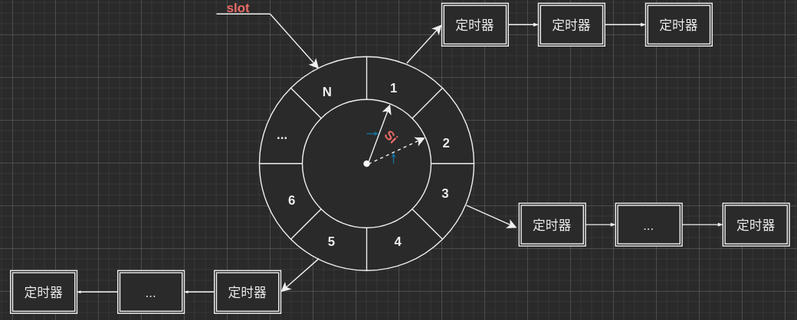

定时器模块
===========================================
定时器处理非活动连接,由于非活跃连接占用了连接资源，严重影响服务器的性能，通过实现一个服务器定时器，处理这种非活跃连接，释放连接资源。利用alarm函数周期性地触发SIGALRM信号,该信号的信号处理函数利用管道通知主循环执行定时器链表上的定时任务.
+ 统一事件源
+ 基于升序链表的定时器
    - 服务器首先创建定时器容器链表，然后用统一事件源将异常事件，读写事件和信号事件统一处理，根据不同事件的对应逻辑使用定时器。
+ 处理非活动连接

+ 整体概述:
    - 服务器为每一个连接创建一个定时器,并进行定时绑定,将所有定时器插入基于升序(*以expiredtime大小升序*)的链表
    - 若主循环收到定时通知,则检查定时器[触发tick()]

+ 功能: 定时检查是否有长时间无反应的连接,若有,服务器则主动断开连接
    + 关键问题
        + 定时器以怎样的方式去触发
            - 一般来讲.把信号发生之后的处理逻辑放在信号的回调函数中,但是忽略了一个事实:在Linux环境中,当我们回调一个信号的回调函数这段时间内,系统至少会忽略同样的信号[**不然会出现死循环等**], 为了不让这些信号被忽略太久,应该办法缩短这个回到函数的执行时间.
            - 一个方法就是:**把回调函数的逻辑移到主函数中去执行**,这就是**统一事件源**(把信号处理当成普通I/O事件一样处理) -> 信号的回调函数不处理逻辑,而是通过**管道,把信号值传递给主循环**,主循环通过使用I/O复用监听管道读端的读事件,从而获取信号值,再执行信号处理逻辑
        + 定时保存的数据结构:
            - 链表式, 时间轮, 最小堆
            - TinyWebServer链表定时器(最好实现的).
            - 我们有一个定时器结点类util_timer，每个结点表示一个客户连接，它保存了双向链表的前后指针，客户数据client_data和回调函数。如果我们判断到这个结点长时间无反应，所以我们调用这个回调函数传入client_data，然后回调函数就会把这个客户断开，并且做一些善后工作。
            - 我们还有链表类sort_timer_lst，这个链表是一个时间递增的结点链表，即从链表头到尾这个客户的最后一次反应时间是递增的。这个链表类当然有插入和删除结点函数。并且还有adjust_timer调整链表位置函数，作用是当一个客户有了反应，那么我们需要更新他的最后一次反应时间，那么为了维护链表的递增特性，我们需要这么一个调整位置的函数。此外，这个类还有一个检查函数(定时清扫)，作用是我们上文提到统一了事件源，把信号回调函数逻辑搬到主函数执行，所以这个定时清扫检查逻辑就是在这个检查函数。主函数判断到信号来了，就执行这个函数进行检查链表中长时间无反应的结点进行清扫。


+  定时器结构: 链表式, 时间轮, 最小堆[在不同场景下需要考虑效率和时间复杂度]
    + 1. 基于升序链表的定时器:
            - 添加定时器: **O(n)**,因为要保持顺序,每次插入都需要遍历链表找到合适的位置
            - 当有大量的定时器时就会存在性能问题,此时可以考虑使用时间轮
    + 2. 时间轮[类似钟表]:
        - 时间轮有N个槽,每个槽指向一个链表
        - 时间轮已恒定速度顺时针转动, 每转动一次的时间间隔为一个滴答间隔si,转动一周的时间为T = N*si
        - 插入槽位置ts = (cur_slot + (ti/si)) %N, 可以在O(1)时间内完成
        - 示意图:
            
        + 复杂的时间轮可以有多个轮子[类似水表]
    + 3. 时间堆:  用最小堆实现的定时器称为时间堆.
            >>>*基于链表和时间轮的定时器是以固定的频率调用tick()函数, 一次检查到期的定时器然后执行到期定时器上的回调函数**时间间隔是固定的**
            >>>* 时间堆每次从所有定时器中找出超时时间最小定时器的时间作为执行tick()的间隔**时间间隔是动态变化的** 


Other
===========================================
- 非活跃连接 : 客户端(浏览器)与服务器建立连接后,长时间不交换数据,一直占用服务器端的文件描述符,导致连接资源的浪费

- 定时事件 : 固定一段时间后触发某段代码,由该代码处理一个事件(比如从内核事件表删除事件,且关闭文件描述符,释放连接资源)

+ 定时器: 利用结构体等形式,将多种定时事件进行封装(本web服务器只涉及到一种定时器:[定期检查非活动连接])
    - 定时器是对定时事件的封装

+ 定时器容器: 使用某种容器类数据结构,将定时器组合起来,便于对定时事件的统一管理
    - 容器类的数据结构
    + 实现了三种定时器
        - 基于升序链表的定时器
        - 基于时间轮的定时器
        - 基于时间堆的定时器

+ 定时器的设计
    + 本项目将 连接资源[用户数据],定时事件[回调函数],超时时间[expire] 封装起来作为定时器类
        - 连接资源[用户数据]: 包含 客户socket套接字, 文件描述符, 定时器
        - 定时时间[回调函数]: 一般有用户定义,这里是删除非活动连接[socket上的注册事件],并关闭*从内核事件表删除事件并关闭文件描述符,释放占用的连接资源.*
        - 超时时间[expire]: 浏览器和服务器的连接时间 + 固定时间[TIMESLOT],*定时器使用的是绝对时间*
            - alarm 设置为 5s
            - 连接超时为 15s

+ 定时器容器的设计:
    + 本项目定时器容器是带头尾节点的双向升序链表
        - 为每个连接创建一个定时器,再将其添加到链表中,按expire[超时时间]升序排列
        - 执行定时任务时,将到期的定时器从链表中删除

    - 设计双向链表的知识点
        - 插入.删除,便利
        - 添加 T = O(n)
        - 删除 T = O(1)

    - 客户端若在设定时间内有数据发收,则将重新设定定时器的超时时间[*这里只是往后延长超时时间*](+ 3 * SLOTITME ??)

+ Linux提供了三种定时器方法:
    + socket选项SO_RECVTIMEO 和 SO_SNDTIMEO
        - SO_RCVTIMEO 设置接收数据超时时间
        - SO_SNDTIMEO 设置发送数据超时时间
    + SIGALRM信号
        +  利用 alarm函数周期性地触发SIGALRM信号,信号处理函数利用管道通知主循环,主循环收到信号后对升序链表上的所有定时器进行处理,若该时间段内没有交换数据,则关闭连接,释放所占资源
            - 定时方法与信号通知
            - 定时器及定时器容器的设计和定时任务的处理
    + I/O复用系统调用的超时参数

+  用到的API
   + sigaction结构体:
        ```
        struct sigaction
        {
            void(*sa_handler)(int);
            void(*sa_sigaction)(int, siginfo_t*, void*);
            sigset_t sa_mask;
            int sa_flags;
            void (*sa_restorer)(void)
        }
        ```
        - sa_hanlder 是一个函数指针,指向信号处理函数
        - sa_sgaction 也是一个函数指针,有三个参数,可以获取信号更详细的信息
        - sa_mask 信号掩码[指定信号函数处理期间需要被屏蔽的信号]
        - sa_flags 用于指定信号处理的行为[见书182]
        - sa_restorer 一般不是用
    
    + sigaction系统调用:
        + *int sigaction(int sig, const struct sigaction* act, struct sigcation oact)*; //成功返回 0 , 失败 返回 -1
            - sig 要捕获信号的类型
            - act 指定新的处理方式
            - oact 信号原来的处理方式
    +  *int sigfillset(sigset_t* set)* 
        - 将所有信号加入信号集
    
    + SIGALRM 和 SIGTERM 信号
        - #define SIGALRM 14 //有alarm系统调用产生timer时钟信号
        - #define SIGTERM 15 //终端发出的终止信号

    + alarm()
        - unsigned int alarm(unsinged int seconds)
        - 用来设置SIGALRM信号,经过seconds秒后发送给进程

    + socketpair()
        - int socketpair(int domain, int type, int protocol, int sv[2]) ;//成功返回 0, 失败 -1
        - domain 协议族 PF_UNIX 或 AF_UNIX
        - type 协议 SOCK_STREAM[基于TCP]或者SOCK_DGRAM[基于UDP]
        - protocol 类型,只能为 0
        - sv[2] 套接字句柄对(双向操作)

    + send()
        - size_t send(int sockefd, const void *buf, size_t len, int flag);
        -  发送函数,默认阻塞

        
             
+ Linux信号处理:
    - Linux下的信号采用异步处理机制, 信号处理和当前进程是两条不同的执行路线
        - 进程收到信号,操作系统中断当前进程,转而去执行信号处理函数,完成后在返回中断的地方继续执行
    - 为避免信号竞态现象的发生,信号处理期间系统不会再次触发它(相同的信号)[将其屏蔽]
        - 为确保信号不被屏蔽太久,信号处理函数需要尽可能地快速执行完毕

    - 一般而言,信号处理逻辑会在信号处理函数中实现
        - 在本项目中,将信号处理逻辑放到主循环中,信号被触发后,通过管道通知主循环,主循环将信号处理当作普通的I/O处理.

+ 统一事件源:
    - 指的是将信号事件当作普通I/O事件一样处理
    - 信号被触发后,通过管道将信号传递给主循环[信号处理函数往管道里写入信号值],主循环从管道读端读取信号值[**使用I/O复用系统调用来监听读端是否可读**],实现信号事件和其他文件描述符都可以通过epoll来监听,实现统一处理.

+ question:
    + 问题1:为什么管道写端要设置为非阻塞?
        - send将信息发送给套接字缓冲区,如果缓冲区满了则会阻塞,这是会进一步增加信号处理的执行时间,因此设置为非阻塞的.

    + q2: 没有对非阻塞返回值处理,如果阻塞是不是意味着这一次定时事件失效了?
        - 是的,但是定时事件是非必须立即处理的,可以允许这种情况发生

    + q3: 管道传递的是什么类型,switch_case变量冲突?
        - 信号本身是整数,管道传递的是整数对应的ASCII码的字符
        - switch变量一般是字符或整数,当switch的变量是字符时,case可以是字符也可以是ASCII码
